<p align="center">
  
</p>

<h3 align="center">Full-stack developer · self-hosting evangelist</h3>

---

### 🧭 Il manifesto

```yaml
principio: "se posso ospitarlo io, lo ospito io"
architettura: pragmatica > alla moda
codice: leggibile > geniale
dipendenze: solo quelle che posso sostituire
```

---

### 🛠️ Stack

**Frontend** — Angular · Signals · RxJS · Kendo UI · Nx · Module Federation
**Backend & Infra** — Docker · Kubernetes · self-hosted stack

---

### 📜 logs --tail

```
2026-08  MFE platform  → refactor state management: da servizi custom a Signals mirati
2026-06  MFE platform  → loader condiviso costruito a mano (niente lib esterne se non serve)
2026-06  MFE platform  → grid dati con rendering custom via TemplateRef
```

---

### 🪚 offline mode

Falegnameria e progetti DIY — stessa cura per i dettagli, ritmo decisamente più lento.
